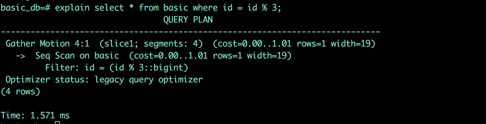
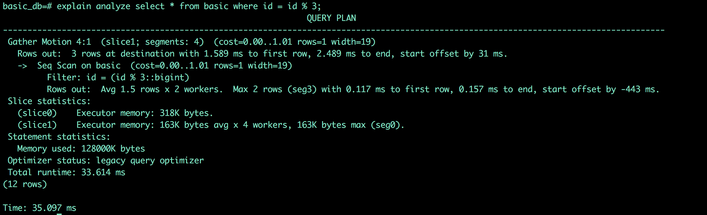

# 如何显示Greenplum执行计划

## EXPLAIN

通过`EXPLAIN`关键字显示其SQL的执行计划而不运行该SQL。


```SQL
explain select * from basic where id = id % 3;;
```

执行计划显示如下图：



## EXPLAIN ANALYZE

如果想要查看详细的SQL执行计划以及运行该所需要调用的资源以及详细输出，可通过'EXPLAIN ANALYZE'关键字进行显示。

这对于确定优化器的估计值与实际值有多接近非常有用。

```SQL
explain analyze select * from basic where id = id % 3;
```



# 如何解读Greenplum执行计划
日常SQL优化过程中，最好用的手段就是通过执行计划。在Greenplum和Deepgreen中，运行 EXPLAIN 后产生的执行计划呈树状，这棵树的每一个分叉，都代表了一个单独的数据库操作，例如：表扫描、表连接、聚合、排序。

由于返回数据行数是从下向上传递的，所以我们在分析执行计划时，也应该自下而上。通常来说，最底下的是表扫描操作（索引、位图索引扫描）。如果查询中涉及到连接、聚合、排序操作，那么表扫描动作的上层就会有对应的这些操作。通常最顶上的部分是节点间数据移动（重分布、广播、聚集操作），在查询过程中，这些操作会涉及到在节点间移动数据。

***EXPLAIN 执行计划中，每一个单独的步骤都会呈现在单独一行里，带有对应的动作类型及查询数据所耗费的时间（查询首行所用时间..查询全部所用时间）:***

> 1.cost

Cost以磁盘页读取为测量单位，1.0等同于一个顺序的磁盘页读取。第一个预估时间是起始消耗，即查询首行所消耗的时间，第二个预估值是总消耗，即查询全部行所用的时间。

> 2.rows

rows指的是执行计划某部分返回的总行数。这个数量通常少于实际的返回行数，反应的只是一个预估的数量。最顶层的返回的预估数量最接近实际查询、修改或删除影响的行数。

> 3.width

操作返回的所有数据所占用的字节数。

*很重要的一点是，上层节点所花费的时间包括所以子节点占用时间，计划最顶层包含总执行花费的预估，这也是我们追求优化的部分。另外执行计划的消耗只与执行计划本身关心的步骤有关，与查询结果传输到客户端的消耗时间等因素无关。*

***如果某个查询的性能特别低，那么我们可以通过查看执行计划来定位问题原因。下面是一些小技巧:***

> 查询计划中是否有操作耗时特别的长？

当我们分析查询计划时，是否有一个异常操作消耗了大部分的查询时间？比如，在执行索引扫描时，时间比预期的要长很多，这时候我们基本可以判断此索引可能已经超期了，需要重建。

> 查询计划预估的时间和真实的时间接近吗？

我们通过运行 EXPLAIN ANALYZE ，查看执行计划预估的返回行数与实际返回的行数是否接近，如果出入很大，说明统计信息是有问题的，我们需要对相关表/列收集更多的统计信息。

> 选择语句中的限定条件是否生效更早？

在执行计划中，选择性限定条件应该更早的应用，目的是让更少的数据返回到上层操作中。如果查询在选择性限定条件应用后表现并不好，返回的消耗依然很大，我们可以收集相关列的统计信息再看看是否会提高性能；另外，还可以通过调整SQL语句中不合理的 WHERE 条件来提高性能。

> 查询计划是否选择了最佳的JOIN顺序？

当我们的查询里面有很多连接操作（JOIN）时，要确保执行计划选择了一个最优连接顺序。拥有大量返回数据的连接应该尽早完成，以保证我们为上层操作返回更少的行。如果执行计划没有选择最佳的连接顺序，我们可以设置参数 join_collapse_limit=1 ，然后在SQL语句中使用明确的JOIN语法强迫执行计划按照特定的执行顺序执行。另外，我们可以收集相关列的统计信息再看看是否会提高性能。

> 查询计划是否有选择性的扫描分区表？

如果我们使用查询中涉及到了分区表数据查询，那么查询计划是否直接定位到扫描满足条件的分区，而不是扫描整张表。

> 查询计划是否适当的选择Hash Aggregate和Hash Join操作？

Hash操作比其他类型的聚合或者连接操作要快很多，行数据的比较和分类操作是在内存中进行，而不是通过读写磁盘完成。为了能够使用Hash操作，我们必须保证有足够的 work memory 可以容纳查询计划返回的行数据，所以我们可以通过尝试增加work memory来提高查询性能。通过运行EXPLAIN ANALYZE命令，这样可以看出哪些计划会有数据使用到磁盘，需要多少额外的work memory等，为work memory的调整提供参考。